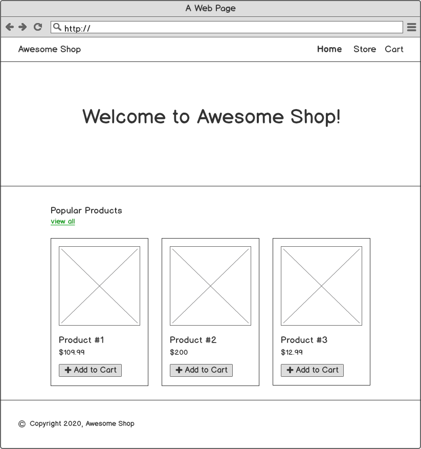
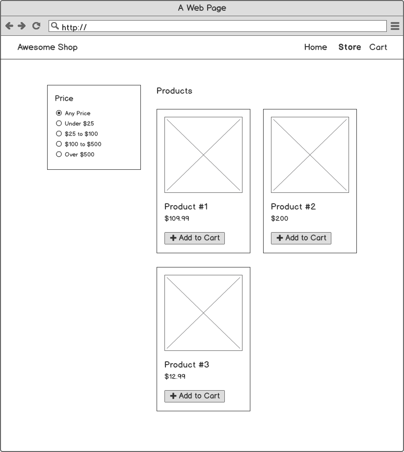
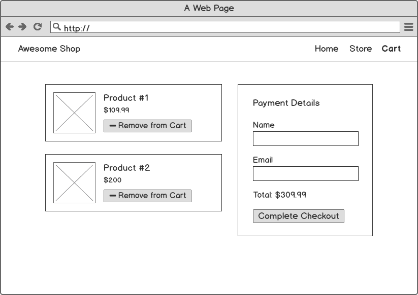
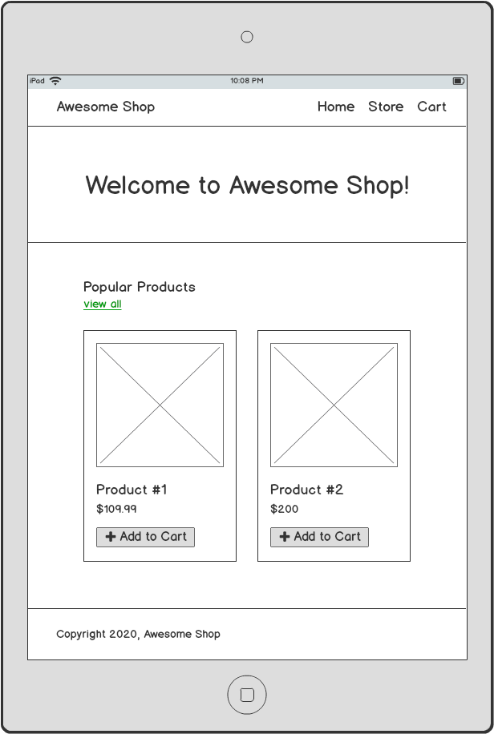
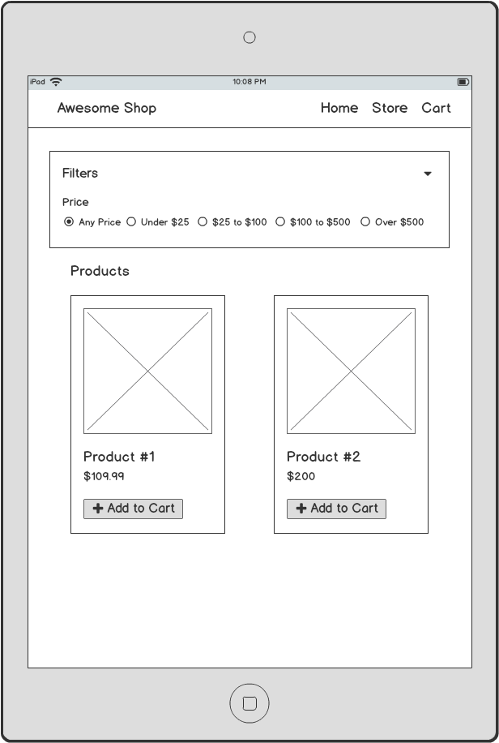
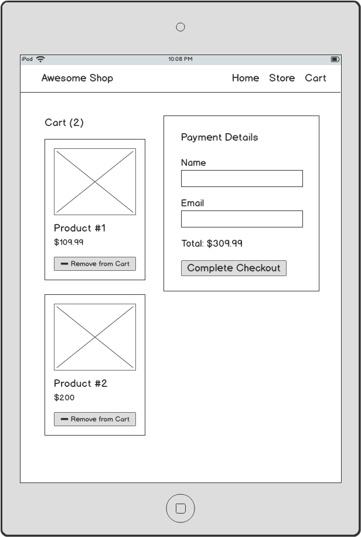
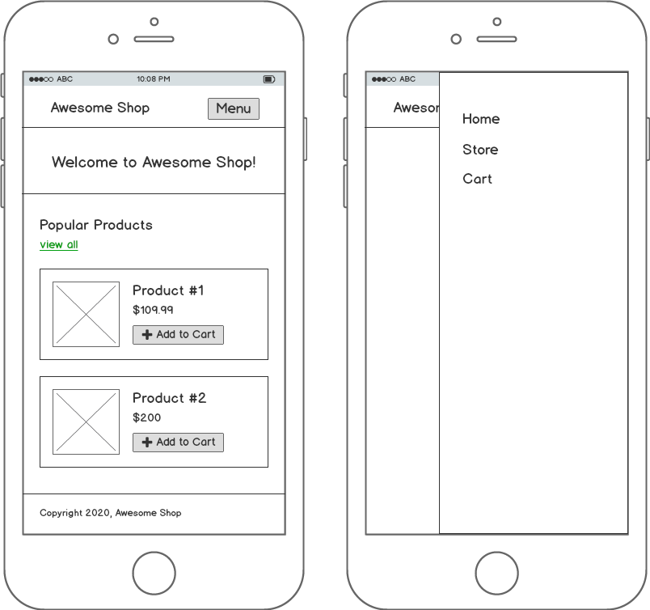
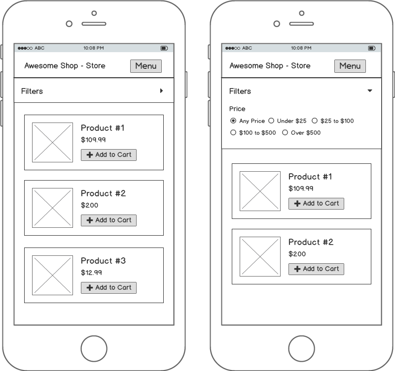
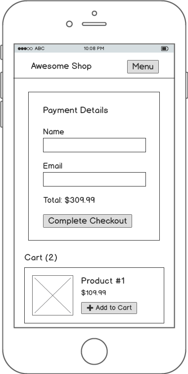

# Vuetify Awesome Store Responsive Demo

This project is a front-end application that demonstrates Vuetify's responsive grid components.

## Table of Contents

1. [Mockups](#mockups)
    1. [Desktop](#desktop)
    1. [Tablet](#tablet)
    1. [Mobile](#mobile)
1. [Commands](#commands)

## Mockups

### Desktop

<p>Home Page:</p>


<p>Store Page:</p>


<p>Cart Page:</p>


### Tablet

<p>Home Page:</p>


<p>Store Page:</p>


<p>Cart Page:</p>


### Mobile

<p>Home Page:</p>


<p>Store Page:</p>


<p>Cart Page:</p>


## Commands

### Project setup
```
npm install
```

### Compiles and hot-reloads for development
```
npm run serve
```

### Compiles and minifies for production
```
npm run build
```

### Lints and fixes files
```
npm run lint
```

### Run your unit tests
```
npm run test:unit
```

### Run your end-to-end tests
```
npm run test:e2e
```
